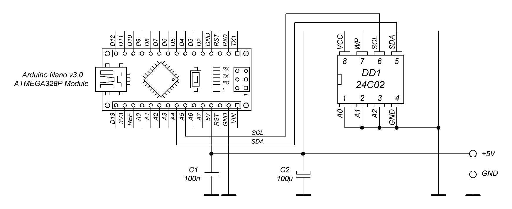

# Saleae-EEPROM-FIX
This project aims to restore the functionality of a logic analyzer (24MHz8CH), a clone of Saleae, by reprogramming the EEPROM using Arduino.
It can be helpful if your device has suddenly stopped being recognized by Saleae applications, just like mine did. This situation can occur when the EEPROM data becomes corrupted, causing the VID/PID to become invalid.
# Connection


The AT24C02 EEPROM can be flashed without desoldering by using the [SOIC8 test clip](img/SOIC8_test_clip.jpg) ([$3 Amazon price](https://www.amazon.com/Circuit-Programming-Programmer-TL866CS-EZP2010/dp/B07VFCTF7T/ref=sr_1_4?keywords=soic8+clip&qid=1688112851&sr=8-4)). In this case, it is important to disconnect the USB connection of the analyzer. Once the clip is connected and the Arduino is connected to the PC, the LEDs on the analyzer may turn on, which is a normal behavior. Additionally, when using the test clip method, the capacitors C1 and C2 are not required.

# How to use
First of all compile the project and upload to Arduino board.
Connect the Arduino board and EEPROM.
Open Serial Monitor (use serial speed 57600), next menu should be appeared:

```
Fix EEPROM 24C02 of Saleae Logic Analyzer 24MHz8Ch (Clone): 
r - Read EEPROM 
w - Write data. Fix the EEPROM
```

Depending on your needs choose command `r` or `w` (case sensitive).

# Links
* [Saleae clone 24MHz 8 Channel LA looses its brains](https://www.eevblog.com/forum/testgear/saleae-clone-24mhz-8-channel-la-looses-its-brains/)
* [24c02 library for Arduino](https://www.kn34pc.com/spr/arduino_24c02.html)
